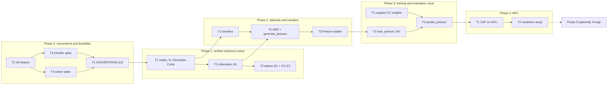

# Learning the 2D Poisson solution operator on a Chebyshev grid

As of 2026-10-05. Status: **signed off** on 2026-10-05 by the author (AHA-HH);
amended 2026-10-08 after Phase 0 (decision 10) and for the Phase 1 toolkit (decision 12),
2026-10-09 after Phase 2 (decisions 14 and 15), and 2026-10-09 for Phase 3 planning
(decision 16). The decisions are recorded in Section 12. This document is the
specification for the phase plans.

This document designs the first 2D experiment of `sciml-rs` that uses data on a Chebyshev
grid. The experiment learns the solution operator f ↦ u of the Poisson equation on a square
with homogeneous Dirichlet conditions. Reference data come from a solver written in this
repository on RLST, and a Burn FNO is trained on them. `docs/CONVENTIONS.md` wins on any
conflict. This design proposes a new section for it (Section 8) and changes none of its
existing sections.

In one paragraph: forcings f are Gaussian random fields, sampled exactly at
Chebyshev–Gauss–Lobatto nodes from a truncated sine series. Reference solutions u are
computed in f64 by Chebyshev collocation, solved by fast diagonalisation on RLST's dense
eigendecomposition, and checked against the exact sine-series solution. A sparse, symmetric
second-order discretisation (Q1) solved by RLST's conjugate gradients serves as an
independent cross-check. Both fields
are interpolated barycentrically to a uniform grid, and the existing FNO is trained there
unchanged. Predictions are mapped back to the Chebyshev nodes with Floater–Hormann rational
interpolation. Solver, transfer and model errors are reported separately. Resolutions are
staged: 33² for tests, 65² for the first local training run, 129² for the first HPC run,
and 257² for the resolution study. Grid transfers are built in this repository; the
Chebyshev toolkit (nodes, differentiation matrices, Clenshaw–Curtis weights) wraps RLST's
FFTW-backed coefficient transforms (decision 12). RLST, and with it FFTW, sits behind an
optional cargo feature, so the default build and its licence are unchanged.

## 1. Assessment

### 1.1 Size of today's crate

Measured on `974f8db`. "Code" excludes blank and `//` lines.

| File | Lines | Code | Tests |
| --- | --- | --- | --- |
| `models/fno.rs` | 1562 | 1198 | 36 |
| `layers/spectral_convolution.rs` | 756 | 512 | 19 |
| `training/trainer.rs` | 556 | 402 | 6 |
| `data/transforms/normalizers.rs` | 507 | 371 | 13 |
| `losses/data_losses.rs` | 494 | 349 | 21 |
| `data/grids.rs` | 361 | 266 | 11 |
| `data/loaders/darcy.rs` | 312 | 216 | 6 |
| `data/device_batcher.rs` | 300 | 217 | 6 |
| `data/io/readers/mat.rs` | 226 | 178 | 7 |
| `data/loaders/burgers.rs` | 217 | 155 | 3 |
| other `src/` files | – | – | 20 |
| `tests/` (2 binaries) | 389 | 293 | 5 |
| **Total** | `src/` 6748 | – | 148 unit + 5 integration |

Baseline on this branch: `cargo test` passes all 162 tests (unit, integration and
doctests), and clippy, fmt and doc are clean (verified on `1ee3b69`; later commits changed documentation only).

### 1.2 The 2D pipeline today (Darcy)

**What it does.** `examples/train/darcy.rs` is the 2D entry point. It hardcodes n_train =
1000, n_test = 100 and a subsampling rate of 5 (:32–40). It reads
`datasets/piececonst_r421_N1024_smooth{1,2}.mat` (:42–44). The model is an FNO with modes
[12, 12], width 32, 4 layers and padding `Some(9)` (:57–71). Training runs 500 epochs at
batch 20, with lr 1e-3, weight decay 1e-4 and min_lr 1e-5 (:73–78).

`data/loaders/darcy.rs` reads the fields `coeff` and `sol` (:99–100) with `MatFileReader`,
as `[samples, s, s]`. The raw resolution is pinned to 421 (:37–39, checked at :141). x and
y are normalised pointwise with `UnitGaussianNormalizer`, and `y_test` stays in physical
units (:153–159, CONVENTIONS §10). The loader returns inputs `[n, s, s, 1]` and targets
`[n, s, s]`.

The batcher, `device_loader` and `trainers/darcy.rs` are generic apart from their names.
`trainer.rs` uses Adam with a cosine schedule. It trains and tests on
`LpLoss::rel` with p = 2 and `Reduction::Sum` (:305), so every grid point has equal
weight. Run artifacts go to `runs/<name>_<unix_secs>/`.

**What carries over.** All of the model, training, batching, normalisation and artifact
code. A Poisson loader is the Darcy loader with the field names, the file reader and the
resolution check parameterised.

**What is missing.**
- Anything Chebyshev, non-uniform, interpolating or Poisson. A case-insensitive grep for
  `chebyshev|cheb|non-uniform|interpol|poisson|laplac` over `src/`, `tests/` and
  `examples/` finds nothing.
- Reader dispatch by file format. The `.npz` reader (`data/io/readers/npz.rs`, fields by
  name) works, but no loader calls it.
- Quadrature-weighted errors on a non-uniform grid. `LpLoss::abs` assumes uniform
  spacing (CONVENTIONS §11).
- Non-uniform coordinates in the model. `FNO::grid_cl` always generates a uniform [0, 1]
  grid (CONVENTIONS §2). `data::grids::grid_from_axes` accepts arbitrary axes, but the
  model never sees them.

### 1.3 RLST

Checked on rlst 0.9.0, the latest release on crates.io.
Citations are to its sources.

- **Dense linear algebra.** It always depends on `blas` 0.23 and `lapack` 0.20
  (Cargo.toml:130, 152), but does not choose a provider: the final binary must add one. On
  macOS this is `blas-src`/`lapack-src` with `accelerate`; on Linux, OpenBLAS
  (`src/doc/getting_started.rs:68–87`). A program that uses no BLAS routine links without a
  provider; one that calls LAPACK fails to link (`_dgees_`, `_dtrsyl_` undefined).
- **Solvers for this problem.**
  - `solve_sylvester` solves A X ± X B = scale · C, through Schur forms and `trsyl`
    (`decompositions.rs:268–283`, `dense/linalg/lapack/sylvester.rs:94–99`). Callers
    must check `status()` and `scale()`.
  - LU, Cholesky, symmetric `eigh` and general `eig` are also available.
    `eig(EigMode::RightEigenvectors)` panics on every input in 0.9.0;
    `BothEigenvectors` works (Phase 0 T4, `spikes/solver/REPORT.md`).
  - Phase 0 T4 chose fast diagonalisation over `solve_sylvester`, which recomputes both
    Schur forms on every call and, even with reuse, is 9.8× slower per solve at n = 257
    (decision 10).
- **Sparse matrices and iterative solvers.**
  - `CsrMatrix::from_aij` assembles from triplets, summing duplicates
    (`sparse/csr_mat.rs:135–141`).
  - Two Krylov solvers: `CgIteration` (default tol 1e-6 relative, max 1000 iterations;
    `run()` returns the residual, not a converged flag) and `GmresIteration`
    (`operator/algorithms/{conjugate_gradients,gmres}.rs`).
  - There are **no preconditioners**. A custom `OperatorBase` can apply one, matrix-free
    (`traits/abstract_operator.rs:26–53`).
  - A sparse direct solve exists only in the separate, GPL `rlst-suitesparse`.
- **Chebyshev tools.** The `chebychev` module (values ↔ coefficients, derivatives) needs
  the `fftw` feature (`lib.rs:30–31`). It was not used at sign-off; since decision 12 the
  Phase 1 toolkit builds D, D² and the Clenshaw–Curtis weights from it. The `interpolation` module
  needs no FFTW (`lib.rs:39`). It has `chebychev_points`, **descending** on [−1, 1]
  (`interpolation.rs:90–116`), barycentric weights, and 1D/2D/3D barycentric evaluation.
  This design uses it only as an independent test oracle (Section 11). RLST has no
  differentiation matrices.
- **The `burn` feature** pulls `burn = "0.21"` from crates.io; our fork is
  `0.22.0-pre.4`. Not built, but inferred: the two versions' tensor types are distinct, so
  conversions would not type-check. Data cross the boundary as `Vec`/slices instead.
- **Build.** A program using CSR + CG, `solve_sylvester` and `eigh` on rlst 0.9.0 with
  Accelerate built (cold, 17 s) and ran on the development Mac (arm64). Ubuntu was not
  tried.

## 2. Requirements

| # | Requirement | How the design meets it | Change? |
| --- | --- | --- | --- |
| 1 | Learn f ↦ u for −Δu = f on Ω = [−1, 1]², u = 0 on ∂Ω, with data on a Chebyshev grid | §3, §6 | – |
| 2 | Reference solver in Rust, on RLST | Collocation solved by fast diagonalisation on RLST's `eig`; sparse SPD Q1 + `CgIteration` as validation oracle (§4) | new module |
| 3 | ~~No FFTW in the build~~ Superseded by decision 12: no FFTW in the default build | Transfers built in this crate; the Chebyshev toolkit uses RLST's `fftw` + `fftw_system`, only under `chebyshev` (§9) | `Cargo.toml` |
| 4 | Default build and licence unchanged | RLST and the BLAS provider behind an optional feature `chebyshev` (§9) | `Cargo.toml` |
| 5 | Existing FNO unchanged in the baseline | Interpolate to a uniform grid (§6) | none |
| 6 | Staged resolutions: 33² tests, 65² first local run, 129² first HPC run, 257² resolution study | §5.3 | – |
| 7 | Gaussian random field forcings | §3.3 | – |
| 8 | Solver, transfer and model errors separated | §7 | new evaluation code |
| 9 | Every fast path tested against a trusted slow one | §11 | – |
| 10 | Conventions stated before code relies on them | §8, Phase 0 | `CONVENTIONS.md` |

## 3. Problem

### 3.1 Equation and domain

```math
-\Delta u = f \ \text{in}\ \Omega = [-1, 1]^2, \qquad u = 0 \ \text{on}\ \partial\Omega
```

The square matches the natural interval of Chebyshev polynomials. The model's coordinate
channels on [0, 1] (CONVENTIONS §2) map to it by x = 2ξ − 1.

### 3.2 Chebyshev–Gauss–Lobatto nodes

With n nodes per axis (n = 2^k + 1), stored in **ascending** order:

```math
x_j = -\cos\Big(\frac{\pi j}{n - 1}\Big), \qquad j = 0, \dots, n - 1
```

Ascending order matches the uniform grid's orientation (CONVENTIONS §2), so a field and its
uniform interpolant share index direction. RLST's `chebychev_points` is descending, so the
test oracle reverses it. A field is stored as `F[i, j] = f(x_i, y_j)`: array axis 1 is x and
axis 2 is y, the 'ij' convention of `data::grids`. The boundary nodes j = 0 and j = n − 1
are included and carry u = 0.

### 3.3 Forcing family

Gaussian random fields with covariance (−Δ + τ²)^(−α), as in Li et al.'s Darcy data, are
sampled by their Karhunen–Loève expansion in the Dirichlet eigenfunctions of −Δ on Ω:

```math
f_K(x, y) = \frac{1}{\sqrt{S_K}} \sum_{k, l = 1}^{K} \xi_{kl}\, \lambda_{kl}^{1/2}
\sin\Big(\frac{k\pi(x+1)}{2}\Big) \sin\Big(\frac{l\pi(y+1)}{2}\Big)
```

```math
\lambda_{kl} = \big(\mu_{kl} + \tau^2\big)^{-\alpha}, \quad
\mu_{kl} = \frac{\pi^2}{4}(k^2 + l^2), \quad
S_K = \frac{1}{4}\sum_{k, l = 1}^{K} \lambda_{kl}, \quad \xi_{kl} \sim \mathcal{N}(0, 1)
```

- **Parameters:** τ = 3 and α = 2, Li et al.'s (−Δ + 9I)^−2.
- **Normalisation:** each sine factor has unit mean square on [−1, 1], so the expected
  mean square of the unnormalised sum over Ω is S_K. Dividing by √S_K makes the expected
  RMS of f_K equal to 1 for every K. Changing the truncation therefore does not change the
  amplitude of the samples.
- **Nested draws:** the ξ_kl of a sample are drawn from its seed in a fixed order over the
  largest K in use, and a smaller K keeps the leading block. So f_K at a small K is the
  truncation of the same sample at a larger K, apart from the normalisation factor.
- **Exact evaluation:** the series is evaluated at the nodes directly, with no FFT and
  no interpolation, at a cost of O(K² n²) per sample.
- **Explicit K override:** K(n) below is the default. A dataset may set K explicitly,
  recorded in its sidecar; this is used only for the K = 32 evaluation sets of §5.3, so
  that a model trained at 65² is tested on the same fields at finer grids.
- **Truncation scales with resolution:** K(n) = min((n − 1)/2, 64). That gives K = 16 at
  33², 32 at 65², and 64 at 129² and 257². K = 64 is the maximum production truncation,
  so the 129² and 257² datasets contain the same fields, which is what the resolution
  study needs.
- **Unresolved-mode energy:** the fraction of the full series' expected energy outside
  the truncation, computed by summing λ_kl to convergence (k, l ≤ 3000, plus an integral
  tail):

  | K | 16 | 32 | 64 | 128 |
  | --- | --- | --- | --- | --- |
  | ε_K | 1.9e-2 | 4.9e-3 | 1.3e-3 | 3.2e-4 |

  The documented tolerance is ε_K ≤ 5e-3 for every training and evaluation dataset
  (stages 2–4 of §5.3). Stage 1 (33², K = 16) is for tests and debugging only and is
  exempt; its ε_K is recorded in its sidecar. ε_K measures f; in u the tail is further
  damped by 1/μ_kl. Phase 0 T3 confirms the table and the tolerance.
- **Why sine and not cosine:** with the sine basis f = 0 on ∂Ω. If f is nonzero at a
  corner, u has an r² log r corner singularity, and the convergence of any Chebyshev
  method drops from spectral to algebraic. A cosine (Neumann) KL basis, as Li et al. use,
  would bring that singularity into every sample.

### 3.4 Norms and quadrature

Errors on the Chebyshev grid use Clenshaw–Curtis weights w_i (exact for polynomials of
degree n − 1), in tensor product:

```math
\lVert v \rVert_{L^2(\Omega)}^2 \approx \sum_{i, j} w_i\, w_j\, v(x_i, y_j)^2
```

Errors on the uniform grid use `LpLoss` (CONVENTIONS §11). Training keeps `LpLoss::rel`
with equal weights, as today.

## 4. Reference solver

### 4.1 Options

| Option | Matrix | RLST routine | Accuracy | Cost (n per axis) |
| --- | --- | --- | --- | --- |
| A. Chebyshev collocation, interior equations as a Sylvester equation | dense, non-symmetric, κ = O(n⁴) | `eig` (fast diagonalisation); `solve_sylvester` measured and ruled out | spectral | O(n³) setup, O(n³) per solve in four GEMMs |
| B. Collocation as one Kronecker-sum system | dense (n − 2)² square | LU `solve` | spectral | O(n⁶): only n ≤ 65 |
| C. Second-order finite volume or Q1 FEM on the CGL tensor mesh | sparse, **SPD**, 5 or 9 points | `CsrMatrix` + `CgIteration` | O(h_max²) | O(n² · iterations); no preconditioner, so about n iterations or more |
| D. Collocation solved by GMRES, preconditioned by C (Orszag 1980) | dense apply + sparse preconditioner | `GmresIteration` + custom `OperatorBase` | spectral | needs an inner solve with C at every iteration |
| E. Legendre–Galerkin (Shen 1994) | sparse banded, SPD | `CgIteration` | spectral | needs Legendre ↔ CGL transforms, not available here |

On the interior nodes, option A is the separable equation

```math
-D_{xx}\, U - U\, D_{yy}^{\mathsf T} = F
```

with D_xx and D_yy the interior blocks of the Chebyshev second-derivative matrices along x
and y, and U, F the interior values. They are equal when n_x = n_y, but kept separate so
that rectangular grids work. Boundary values are zero, so they drop out.

### 4.2 Decision

- **Authoritative training labels: A.** Spectral accuracy, f64, O(n³).
  - The equation is solved by fast diagonalisation (Phase 0 T4, decision 10): at setup,
    D_xx = V Λ V⁻¹ from rlst's `eig(BothEigenvectors)` (`RightEigenvectors` panics in
    rlst 0.9.0); V⁻¹ = diag(1 / u_jᵀ v_j) Uᵀ is formed from the left eigenvectors U,
    with no LU (decision 13); each solve is Ĝ = V_x⁻¹ F V_y⁻ᵀ, a pointwise division by
    −(λ_i + μ_j), and U = V_x Û V_yᵀ.
  - The Sylvester route is ruled out: `solve_sylvester` recomputes both Schur forms on
    every call, and even with the Schur forms reused (`trsyl` directly) it is 9.8× slower
    per solve at n = 257 and agrees with fast diagonalisation only to 1.2e-12.
  - The problem-specific wrapper lives in this crate, `pde::poisson::collocation`.
  - The eigendecomposition of D_xx and D_yy is computed once and reused for every sample.
    At 257² setup is 36 ms and a solve 0.6 ms, so 1200 samples take about 1.6 s with the
    GRF evaluation.
- **Independent validation oracle: C.**
  - A sparse SPD Q1 finite-element discretisation (consistent mass and load) on the CGL
    tensor mesh, solved with RLST's CG to relative residual 1e-6 (Phase 0 T4). It runs on
    selected cases (the manufactured solutions and a sample of the GRF forcings), not on
    every sample. Finite volume was equally second order and slightly faster and more
    accurate, but the T4 rule (fewest CG iterations) chose Q1; the margin is under 1.5%.
  - The two solutions are compared on a common grid: C's solution lives on the CGL nodes
    themselves, so no interpolation is needed. The difference must decrease at C's second
    order as n grows.
  - C never produces training labels. It is the discretisation that extends to 3D and
    distributed grids, where dense solves stop scaling, but not yet as it stands:
    unpreconditioned CG needs about 3× more iterations per doubling of n (2189–4731 at
    257² for tol 1e-13), so scaling needs a preconditioner first.
  - Q1 is hand-written: on the tensor CGL mesh the matrix is exactly K₁ ⊗ M₁ + M₁ ⊗ K₁
    from the 1D P1 stiffness and mass. The `nd` crates (ndelement, ndmesh,
    ndfunctionspace) are the intended finite-element layer once C needs unstructured, 3D
    or distributed meshes, but they cannot be used yet (decision 11).
- **Not now: B** (only as a test oracle at n ≤ 33), **D** (only if A's cost becomes a
  problem), and **E** (needs transforms we do not have).

### 4.3 Verification

- **Manufactured solutions.** u = sin(πx) sin(πy), with f = 2π² u; the polynomial
  u = (1 − x²)(1 − y²)(x + y²); and a non-symmetric one, u = (1 − x²)(1 − y²) e^(x + 2y).
- **Option A** reaches its f64 floor by n = 33 on the first two (T4: 1.1e-14 and
  1.2e-14). A convergence study over n = 9..129 must show spectral decay down to a stated
  floor.
- **Option A on GRF forcings** matches the exact sine-series solution of the truncated
  forcing, u = Σ c_kl / μ_kl · sin · sin with c_kl the forcing coefficients: T4 measured at
  most 7.4e-10 relative CC-L² at n = 65 and 1.9e-12 at n ≥ 129 (2.5e-7 at n = 33,
  stage 1). This is both a test oracle and a per-sample label check (§5.1).
- **Option C** must show order 2 on the same functions.
- **A against B** agree to round-off at n ≤ 33.
- **D^(2)** is checked against Trefethen's `cheb` formulas, and on polynomials, where it
  is exact.

## 5. Datasets

### 5.1 Generation

A new example, `generate_poisson` (feature `chebyshev`), writes for each resolution:

- one `.npz` per split, with fields `f` and `u`, `[N, n, n]`, f64;
- fields `x` and `y` holding the nodes;
- a JSON sidecar recording (K, τ, α), whether K was set explicitly (§3.3), the seeds, n,
  the git commit and the label check below.

**Label check.** For every sample the generator also evaluates the exact sine-series
solution of the truncated forcing (coefficients c_kl / μ_kl, §4.3) at the nodes and
computes the relative Clenshaw–Curtis L² discrepancy ‖u_A − u_series‖ / ‖u_series‖. The
maximum and mean per split go into the sidecar. For n ≥ 65 the generator aborts if any
sample exceeds 1e-8 (T4 observed at most 7.4e-10 at 65 and 1.9e-12 at n ≥ 129). Stage 1
(n = 33) records the value but does not check it.

Sample i of a split uses seed `base_seed + i`, and the train and test bases differ.
Reading uses the existing `.npz` reader. Writing uses `ndarray-npy` (already a
dependency).

### 5.2 Loader

A Poisson loader follows `loaders/darcy.rs`: inputs `[N, s, s, 1]`, targets `[N, s, s]`,
pointwise `UnitGaussianNormalizer` on x and y fitted on the training split, `y_test` left
raw (CONVENTIONS §10). It reads `.npz` and applies the Chebyshev → uniform transfer
(§6.2) at load time, in f64, before normalisation. Darcy's loader stays as it is.

### 5.3 Resolutions and sizes

| Stage | Chebyshev n | Uniform s (model grid) | Purpose | Where |
| --- | --- | --- | --- | --- |
| 1 | 33 | 32 | unit tests, manufactured solutions, debugging | local |
| 2 | 65 | 64 | first end-to-end FNO training run | local (flex, metal) |
| 3 | 129 | 128 | first production run: accuracy and performance | HPC, GPU |
| 4 | 257 | 256 | resolution generalisation and scaling, after profiling stage 3 | HPC, GPU |

Sizes: 1000 train / 200 test per resolution (as Li et al.), from the same seeds at every
resolution.

**K = 32 evaluation sets.** For the resolution study (§7), two extra test sets hold the
65² test fields (K = 32, explicit override, the 65² test seeds) at finer grids:

| Set | Chebyshev n | K | Samples | Purpose |
| --- | --- | --- | --- | --- |
| 3e | 129 | 32 | 200 test | evaluate a 65²-trained model at 129² |
| 4e | 257 | 32 | 200 test | evaluate a 65²-trained model at 257² |

The K = 64 sets of stages 3–4 stay for the 129 → 257 study. Generation is cheap (about
1.6 s for 1200 samples at 257², T4), so these sets can be made wherever Phase 4 needs them.

**Storage** (f64, f + u, 1200 samples): about 80 MB at 65², 320 MB at 129² and 1.27 GB
at 257². Each 200-sample K = 32 set is about 53 MB at 129² and 211 MB at 257².

**Note on the uniform sizes.** The FFT in this crate accepts any length (Bluestein,
CONVENTIONS §4), and padding already makes the extent non-power-of-two. A uniform grid of
n points (33, 65, …) with both endpoints has spacing 2/(n − 1), so its points are every
second node of a power-of-two dyadic grid. Using it would avoid one interpolation
mismatch. The table keeps the stated sizes; Phase 0 T3 also measures s = n, and the
sizes switch only if s = n is clearly better (decision 5).

## 6. Chebyshev data and the FNO

### 6.1 Options

| Option | Model change | Convention change | Transfer error | Notes |
| --- | --- | --- | --- | --- |
| 1. Interpolate to a uniform grid, unchanged FNO, interpolate back | none | new §12 only | yes, both ways | baseline; Geo-FNO reports learned maps about 2× better than interpolation (Li et al. 2023) |
| 2. θ-map: x = cos θ, so CGL nodes are uniform in θ; even extension then FFT (a DCT-I) | grid channels in θ; extension and crop around the spectral layers | §2, §5 (version bump) | none | 4× the points in 2D; evenness of the output only approximate |
| 3. Chebyshev/DCT spectral layer (SNO, Fanaskov & Oseledets; OPNO, Liu et al. 2022) | new spectral layer, new transform | §4, §5, §6 (version bump) | none | SNO reports 2.2e-2 vs FNO 2.7e-2 on a 2D elliptic problem |
| 4. Mesh-free operators (DeepONet, graph kernels) | new model | new | none | out of scope |

### 6.2 Recommendation and transfers

**Option 1 for every phase up to the HPC runs.** It needs no model change and no change to
CONVENTIONS §1–§6. Its errors are measured separately (§7).

- **Chebyshev → uniform:** barycentric polynomial interpolation, tensor-product, as one
  dense 1D matrix applied along each axis. It is forward stable on Chebyshev nodes
  (Higham 2004; Berrut & Trefethen 2004) and spectrally accurate for smooth fields.
- **Uniform → Chebyshev:** Floater–Hormann rational interpolation of degree d. Polynomial
  interpolation from uniform nodes is ill-conditioned (the Runge phenomenon); FH has no
  real poles and a logarithmically growing Lebesgue constant. d is chosen in Phase 0 from
  measured round-trip errors.
- Both transfers are fixed matrices per (n, s), built once, in f64.

**Option 2 as an optional later comparison (Phase 5).** It does not block completion and
needs its own convention diff.

Decision 2.

## 7. Training and evaluation

- Training on the uniform grid as today: `LpLoss::rel` (p = 2), Adam with cosine
  schedule, FNO modes [12, 12], width 32, 4 layers. Padding `Some(p)` because the problem
  is not periodic; p is chosen in Phase 3 T2 by a full-length sweep over {0, 4, 8, 16}
  (Darcy uses 9 at s = 85; decision 16).
- **Errors reported**, over the test set (mean and maximum); 1–4 are relative L² errors:
  1. **solver:** A against manufactured solutions (§4.3), and A against C as h → 0;
  2. **transfer:** T_uc(T_cu u) − u on the Chebyshev grid, for the test u;
  3. **model:** prediction against T_cu u on the uniform grid (the training metric);
  4. **total:** T_uc(prediction) against u on the Chebyshev grid, with Clenshaw–Curtis
     weights (§3.4);
  5. **boundary:** T_uc(prediction) on the boundary nodes of the Chebyshev grid, where the
     exact value is 0, reported as max |û| / max |u| and as an RMS over ∂Ω.
- **Boundary condition.** The FNO does not enforce u = 0 on ∂Ω, so the Phase 3 baseline
  uses the unchanged FNO and measures the boundary error (error 5) separately. A
  hard-constraint ablation, the output multiplied by (1 − x²)(1 − y²) after
  denormalisation, is considered only if Phase 3 T3's boundary error is meaningful against
  the total error: the mean relative boundary RMS (error 5) is at least 10% of the mean
  error 4 (decision 16).
- **Expectation, to calibrate tests and not as a target:** FNO relative L² errors around
  1e-2 on smooth elliptic problems (Li et al. 2021, Darcy 0.0108 at 85²). Transfer errors
  sit well below that: Phase 0 T3 measured the round trip on u at most 3.6e-5 at 65²,
  4.4e-6 at 129² and 4.8e-7 at 257² (d = 2), so about 1e-5 against a model error of about
  1e-2.
- **Resolution study (stage 4), in two parts, on the same seeds throughout:**
  1. train at 65 (K = 32), evaluate on the K = 32 sets at 129 and 257 (§5.3);
  2. train at 129 (K = 64), evaluate at 257 (K = 64).

  Holding K fixed within each part means only the grid changes, not the fields.

## 8. Conventions diff

Append to `docs/CONVENTIONS.md`:

```markdown
## 12. Chebyshev grids and transfers

- Domain Ω = [−1, 1]². Model coordinates ξ ∈ [0, 1] (§2) map to it by x = 2ξ − 1.
- Chebyshev–Gauss–Lobatto nodes, n per axis, ascending: x_j = −cos(πj/(n − 1)),
  j = 0..n − 1, endpoints included.
- Fields are stored `F[i, j] = f(x_i, y_j)`: axis 1 is x, axis 2 is y.
- Chebyshev → uniform transfer: tensor-product barycentric interpolation. Uniform →
  Chebyshev: tensor-product Floater–Hormann of degree d (recorded here after Phase 0).
- Chebyshev-grid norms use tensor-product Clenshaw–Curtis weights.
- Reference data are f64 on the host; the model sees f32 (§8).
```

And extend §9: "§12 fixes how dataset files and transfers are laid out; a change to it bumps
`CONVENTION_VERSION`." The new section adds to and changes nothing in §1–§6, so no saved
checkpoint changes. Recommendation: add §12 at version 1 and bump only on a later change to
it. Decision 4.

## 9. Dependencies and platform

- **Optional feature `chebyshev`.**
  ```toml
  chebyshev = ["dep:rlst", "rlst/fftw", "rlst/fftw_system", "dep:blas-src", "dep:lapack-src",
               "dep:openblas-src"]
  rlst = { version = "0.9", optional = true, default-features = false }
  ```
  `blas-src`/`lapack-src` use `accelerate` on macOS and `openblas` (system) on Linux,
  selected by target. Without the feature, the crate builds exactly as today.
- **FFTW (decision 12):** RLST's `fftw` and `fftw_system` are enabled under `chebyshev`
  and link the system libfftw3 found by pkg-config (Homebrew `fftw` on macOS,
  `libfftw3-dev` on Linux). FFTW is GPL-2.0+, so `--features chebyshev` builds link GPL
  code; the default build does not.
- **Not enabled:** RLST's `fftw_source`, `fftw_mkl`, `burn` and `mpi` features, and
  `rlst-suitesparse` (GPL).
- **CI:**
  - the existing job is unchanged;
  - a new job runs `cargo clippy --features chebyshev --all-targets` and
    `cargo test --features chebyshev` on Ubuntu, after
    `apt-get install libopenblas-dev libfftw3-dev pkg-config`. The workflow already carries that step,
    commented out.
- **Precision:** the solver, transfers and dataset files are f64 on the host. The model is
  f32 (CONVENTIONS §8).
- **Backends:** the data side is CPU only. Training must hold on flex; metal locally and
  cuda on HPC are run and reported.
- **3D carry-over (noted only):** nodes, differentiation matrices, transfers and
  quadrature are 1D operators applied per axis. Fast diagonalisation, the route chosen for
  A, extends to 3D (one eigendecomposition per axis); the Sylvester form would not.
  Option C extends too, given a preconditioner (§4.2).

## 10. Phases and tasks

This section is the project roadmap. Each phase gets a `docs/phase<N>/README.md` and one
brief per task when it is planned; those briefs refine the rows below and do not change
their order.

**Task numbering.** From Phase 1 on, task numbers are execution order: T<k> depends only
on tasks with a lower number in the same phase, or on earlier phases. Tasks that can run
in parallel get consecutive numbers and say so in "Depends on". Phase 0 is the one
exception: it keeps the numbers it was signed off with and runs T2, then T3 and T4, then
T1 (decision 9).



### Phase 0: conventions and feasibility

- **Goal:** settle conventions, dependencies and the choices the design left open, by
  measurement, before production code is written.
- **Needs:** this design, signed off.

| Task | Delivers | Modules | Depends on |
| --- | --- | --- | --- |
| T1 | CONVENTIONS §12 (Section 8), signed off | `docs/CONVENTIONS.md` | T3, T4 |
| T2 | Feature `chebyshev`, rlst 0.9 dependency, BLAS selection, CI job; verify which dense primitives (Sylvester, `eig`, LU) and CG are public in the pinned version; a smoke test running CG and the Sylvester or eigen route | `Cargo.toml`, `.github/workflows/`, `tests/` | – |
| T3 | Transfer spike: barycentric and FH round-trip errors for n ∈ {33, 65, 129, 257} on smooth and GRF fields; choose d; compare s = n − 1 with s = n; confirm the GRF tail table and tolerance (§3.3) | spike, report | – (T2's dependency setup) |
| T4 | Solver spike: A and C at n = 33..257, error and time; factorisation reuse | spike, report | T2 |

- **Exit:** the checklist in `docs/phase0/README.md`; CONVENTIONS §12 merged at
  `CONVENTION_VERSION` 1.
- **Status (2026-10-08):** done. T2, T3, T4 and T1 merged; the design amended after
  Phase 0 (decision 10).

### Phase 1: verified reference solver

- **Goal:** a tested Chebyshev toolkit and both reference solvers, agreeing with each
  other and with manufactured solutions.
- **Needs:** Phase 0 done.
- **Inputs from Phase 0:** option A is solved by fast diagonalisation, with rlst's
  `eig(BothEigenvectors)` (`RightEigenvectors` panics in rlst 0.9.0); option C uses Q1
  (consistent mass and load) and CG to relative residual 1e-6 (`spikes/solver/REPORT.md`).

| Task | Delivers | Depends on |
| --- | --- | --- |
| T1 | `chebyshev::{nodes, diff_matrix, clenshaw_curtis}` on RLST's coefficient transforms, behind `chebyshev` (decision 12), and their tests | – |
| T2 | `poisson::collocation` (option A) and the manufactured-solution convergence tests | T1 |
| T3 | `poisson::sparse` (option C) with the CG solve and the order-2 test; the A-vs-C check | T1, T2 |

- **Exit:** the §11 rows for nodes, D/D², Clenshaw–Curtis, the collocation solver and the
  sparse solver pass under `--features chebyshev`; A and C agree on the common CGL grid
  as h → 0 (error 1 of §7).
- **Status (2026-10-08):** done. T1, T2 and T3 merged (#13–#15); A and C agree at order
  1.993–1.999. One deviation recorded after the fact (decision 13); the §11 row for A on
  GRF forcings moves to Phase 2 T2.

### Phase 2: datasets and transfers

- **Goal:** Poisson datasets at every stage of §5.3, and a loader that hands the FNO
  uniform-grid tensors.
- **Needs:** Phase 1 T1 (nodes, weights) for T1; Phase 1 T2 (solver A) for T2.
- **Inputs from Phase 0:** Floater–Hormann degree d = 2; uniform size s = n − 1; GRF tail
  table and 5e-3 tolerance confirmed (`spikes/transfers/REPORT.md`, decision 8).

| Task | Delivers | Depends on |
| --- | --- | --- |
| T1 | `chebyshev::transfer` (barycentric, FH) with oracle tests | Phase 1 T1 |
| T2 | GRF sampler (§3.3) with the explicit K override and the `generate_poisson` example; `.npz` + JSON output; the per-sample series label check (§5.1) | Phase 1 T2 |
| T3 | Poisson loader (§5.2) | T1, T2 |

- **Exit:** the §11 rows for both transfers, the GRF sampler, the generator's label check
  and the loader pass; datasets for stages 1–2 (n = 33, 65) generated locally; error 2 of
  §7 measured on them. The K = 32 evaluation sets (§5.3) are generated where Phase 4 needs
  them; they are cheap, so anywhere.
- **Status (2026-10-09):** done. T1, T2 and T3 merged (#18–#20); stage 1–2 datasets
  generated; error 2 and the label check over the full splits recorded (decision 14).
  Inputs to Phase 3 recorded in decision 15.

### Phase 3: training and evaluation, local

- **Goal:** the first end-to-end FNO run on Chebyshev data, with all five errors of §7.
- **Needs:** Phase 2 done; stage 2 dataset (65²).
- **Inputs from Phase 2:** error 2 on the stage 2 test split, max 7.8e-5 and mean 2.0e-5
  (decision 14); the three gaps of decision 15. Plan: `docs/phase3/README.md`.

| Task | Delivers | Depends on |
| --- | --- | --- |
| T1 | Ungated Clenshaw–Curtis weights (closed form) and relative CC-L² error, tested against the RLST-backed weights (decision 15) | – |
| T2 | `train_poisson` example and trainer; padding p chosen by a full-length sweep; first run at 65² on metal and flex | – (parallel with T1) |
| T3 | `predict_poisson`: raw Chebyshev u from the test split, the five errors of §7 on the Chebyshev grid including the boundary error, and the boundary-ablation verdict | T1, T2 |

- **Exit:** the §11 pipeline row (65² training reaches test relative L² ≤ 2e-2,
  decision 16), run on flex and metal; the five errors reported for a stage 2 run. The
  exit states whether the boundary-condition ablation of §7 is warranted, by the rule of
  decision 16. If it is, it becomes a new Phase 3 task, planned then; nothing is added
  for it now.

### Phase 4: HPC

- **Goal:** production accuracy and performance on GPU, and the resolution study.
- **Needs:** Phase 3 done; stage 3–4 datasets and the K = 32 evaluation sets generated
  (on HPC or transferred).

| Task | Delivers | Depends on |
| --- | --- | --- |
| T1 | Production runs at 129² on GPU | – |
| T2 | Resolution study after profiling, in two parts (§7): 65 (K = 32) → 129, 257 on the K = 32 sets; 129 (K = 64) → 257 | T1 |

- **Exit:** cuda runs reported at 129²; both parts of the resolution study reported on
  the same seeds (§7).

### Phase 5 (optional, non-blocking)

θ-map comparison (option 2), with its own convention diff. It starts only after Phase 4
and does not block completion. The question is whether a Chebyshev-native model learns
or generalises across resolutions better than the interpolating baseline. The motivation
is model quality and resolution behaviour, not transfer error: Phase 0 measured the
transfer error at about 1e-5, three orders below the expected model error (decision 10).

Module names are proposals. New code lives under `src/neural_operators/chebyshev/` and
`src/neural_operators/pde/poisson/` (feature-gated where it uses RLST), and
`src/neural_operators/data/loaders/poisson.rs`.

## 11. Tests

| Component | Trusted reference | Tolerance (f64 unless noted) |
| --- | --- | --- |
| CGL nodes, barycentric weights | closed forms; RLST `interpolation` (reversed) for barycentric weights | 1e-14 absolute |
| D, D² | Trefethen's `cheb`; exact on polynomials of degree < n | 1e-10 relative to ‖D‖ |
| Clenshaw–Curtis weights | exact integrals of polynomials of degree ≤ n − 1 | 1e-14 |
| Clenshaw–Curtis weights, closed form (ungated, decisions 15 and 16; Phase 3 T1) | the RLST-backed weights under `chebyshev` | 1e-14 |
| Collocation solver (A) | manufactured solutions; option B at n ≤ 33 | stated floor from the convergence study |
| Collocation solver (A) on GRF | exact sine-series solution | 1e-8 relative CC-L² for n ≥ 65 |
| Sparse solver (C) | manufactured solutions: order 2 ± 0.1; residual ≤ CG tolerance | – |
| Chebyshev → uniform | RLST barycentric evaluation; analytic functions | 1e-12 relative |
| Uniform → Chebyshev (FH) | analytic functions; the measured rate for degree d | from Phase 0 |
| GRF sampler | same seed gives the same field at every n (nodes in common); empirical covariance against the formula | statistical, stated in the brief |
| `generate_poisson` label check | exact sine-series solution, every sample; recorded in the sidecar | aborts above 1e-8 relative CC-L² for n ≥ 65 |
| Loader | shapes, normaliser asymmetry as in Darcy's tests | exact |
| Pipeline | 65² training on flex and metal (Phase 3 T2) | test relative L² ≤ 2e-2, f32 (decision 16) |

## 12. Questions for sign-off

| # | Question | Recommendation |
| --- | --- | --- |
| 1 | Reference solver | Collocation solved as a Sylvester equation (option A) for the data; sparse SPD finite volume or Q1 with RLST CG (option C) as the cross-check and the iterative path (§4.2). Measured in Phase 0: fast diagonalisation and Q1 (decision 10) |
| 2 | How Chebyshev data meet the FNO | Interpolate to uniform with the unchanged FNO (option 1); θ-map as an optional Phase 5 (§6) |
| 3 | GRF basis | Sine (Dirichlet) KL basis, so f = 0 on ∂Ω and no corner singularity; τ = 3, α = 2, K = 64 (§3.3) |
| 4 | Conventions | Add §12 at version 1; changes to it bump from then on (§8) |
| 5 | Uniform grid sizes | Keep 32/64/128/256 as stated, and have Phase 0 T3 also measure s = n (33/65/…); switch if it is clearly better (§5.3) |
| 6 | RLST and BLAS | rlst 0.9 behind the optional feature `chebyshev`, `default-features = false`; Accelerate on macOS, OpenBLAS on Linux; no FFTW, burn, MPI or SuiteSparse (FFTW: superseded by decision 12) |
| 7 | FFTW later | Only as an optional, non-default backend, after supervisor approval, confirmed licensing and a measured benefit (taken up by decision 12) |

Further choices made in this design. They were not asked individually and stand unless
overruled later:
- Nodes stored ascending, fields 'ij' (§3.2).
- Training loss unchanged (equal weights on the uniform grid); Clenshaw–Curtis only for
  evaluation (§3.4).
- 1000 train / 200 test per resolution, the same seeds across resolutions (§5.3).
- Transfers applied in the loader at load time, not stored in the dataset files (§5.2).
- A separate Poisson loader instead of generalising the Darcy one (§5.2).

### Sign-off procedure

The author signs off alone. The questions above are answered and recorded here, the
affected sections are updated, and the status line is set to "signed off". After that, the
CONVENTIONS §12 change (Phase 0 T1) and the Phase 0 plan can start.

### Recorded decisions

Signed off by the author (AHA-HH) on 2026-10-05, in a Claude Code session.

1. **Reference solver: changed.** Authoritative labels come from Chebyshev collocation,
   solved through the separable form −D_xx U − U D_yyᵀ = F as a Sylvester or
   fast-diagonalisation solve on RLST's dense primitives.
   - No public Sylvester routine is assumed. Phase 0 T2 verifies the pinned version, and
     the problem-specific wrapper lives downstream in this crate.
   - The sparse SPD finite-volume or Q1 system with RLST's CG solves selected cases
     independently, is compared on the common CGL grid, and serves as the validation
     oracle and future scalable path. It never supplies training labels (§4.2).
2. **Chebyshev data and the FNO: accepted.** Interpolate to uniform, FNO unchanged;
   θ-map as optional Phase 5 (§6).
3. **GRF: changed.**
   - Homogeneous-Dirichlet sine basis with τ = 3 and α = 2.
   - K = 64 is the maximum production truncation at 129². K scales with resolution,
     K(n) = min((n − 1)/2, 64).
   - Unresolved-mode energy is verified to be at most 5e-3 for stages 2–4.
   - Samples are normalised to unit expected RMS, so their amplitude does not change with
     K (§3.3).
4. **Conventions: accepted.** §12 is added at version 1 (§8).
5. **Uniform sizes: accepted.** 32/64/128/256; Phase 0 T3 also measures s = n (§5.3).
6. **RLST: accepted.** Optional feature `chebyshev`, rlst 0.9 (latest), non-FFTW only
   (§9).
7. **FFTW: accepted.** Possibly later, as an optional, non-default backend, subject to
   supervisor approval, confirmed licensing and a measured performance benefit.
8. **Transfer degree: measured on u (2026-10-06, Phase 0 T3).**
   - On the GRF forcing f, no Floater–Hormann degree d ≤ 8 met the T3 rule (round trip
     ≤ 1e-4 at n = 65, 129, 257 with Lebesgue constant < 10). The top modes of K(n) have
     about 4 uniform points per wavelength.
   - The rule is therefore evaluated on the solution u, the transfer error of §7, since
     T_uc only acts on predicted u.
   - On u, **d = 2**: the worst case is 3.6e-5 at n = 65, and the 1D Lebesgue constant
     (maximum row sum of |T_uc|) is at most 4.9.
   - s = n − 1, the GRF tail table and the 5e-3 tolerance stand as stated.
   - Details: `spikes/transfers/REPORT.md`.
9. **Task numbering and roadmap (2026-10-08).**
   - From Phase 1 on, task numbers within a phase are execution order (§10).
   - Phase 0 keeps its signed-off numbers (T2, T3, T4 merged under them) and runs T2,
     then T3 and T4, then T1.
   - §10 now carries the roadmap: per phase a goal, entry needs, ordered tasks with their
     dependencies, an exit criterion and the Phase 0 results each phase uses. Task
     contents are unchanged.
10. **Amendments after Phase 0 (2026-10-08).** The architecture stands: labels from
    solver A, interpolation to a uniform grid, FNO unchanged. Transfer error (about 1e-5,
    T3) is far below the expected model error (about 1e-2), and A-fd is accurate to 1e-12
    with 1200 samples at 257² generated in about 1.6 s (T4). Where this decision differs
    from decision 1, it supersedes it.
    - **Solver A's route: fast diagonalisation** with `eig(BothEigenvectors)`. Sylvester
      is ruled out: 9.8× slower per solve at n = 257 even with reuse, no factorisation
      reuse through `solve_sylvester`, and agreement only to 1.2e-12 (§4.2).
    - **Solver C: Q1** (consistent mass and load), CG to relative residual 1e-6, as the
      T4 rule chose. Finite volume's edge (22–31% faster per solve, 1.3–3.5× more
      accurate) is noted and not adopted. C is a validation oracle; unpreconditioned CG
      grows about 3× per doubling of n, so it is a scaling path only with a
      preconditioner (§4.2).
    - **Resolution study in two parts:** K = 32 evaluation sets at 129² and 257² (200
      samples, the 65² test seeds, explicit K override) so a 65-trained model is tested
      on the same fields at finer grids; the K = 64 sets stay for 129 → 257 (§3.3, §5.3,
      §7).
    - **Exact sine-series solution** as a test oracle and as a per-sample label check in
      `generate_poisson`: aborts above 1e-8 for n ≥ 65, where T4 observed at most 7.4e-10
      (§4.3, §5.1, §11).
    - **Phase 5 reframed:** does a Chebyshev-native model learn or generalise better?
      Not "remove transfer error", which is already small (§10).
    - **Boundary condition:** the Phase 3 baseline keeps the unchanged FNO, which does not
      enforce u = 0, and reports the boundary error as a fifth error. The hard constraint
      (output × (1 − x²)(1 − y²) after denormalisation) is a later ablation, taken up only
      if Phase 3 T2 (now T3, decision 16) finds the boundary error meaningful against the
      total error. The baseline stays the unchanged FNO of decision 2, and the constraint's benefit is
      measured rather than assumed (§7, §10).
    - **Editorial:** the §10 graph edge P1T3 → P2T2 is corrected to P1T2 → P2T2, matching
      Phase 2's "Needs" row; §1, §1.3, §2, §4 and the Phase 0 status are updated to the
      measured results.
11. **Finite-element library for C: `nd`, deferred (2026-10-08).**
    - `nd` (codeberg.org/nd-project/nd; ndelement, ndmesh and ndfunctionspace 0.4.0,
      BSD-3) is the intended finite-element layer for solver C once it needs unstructured,
      3D or distributed meshes. It supplies elements, meshes and DOF maps; assembly stays
      in this crate.
    - It is not used now: every nd crate depends on rlst 0.6, whose build dependency
      `cc = "=1.2"` cannot share a build with rlst 0.9's `cc = "^1.5"` (Cargo resolves one
      `cc` 1.x per build). This was checked by building nd 0.4 next to rlst 0.9; Cargo
      fails before compiling. nd's `main` is still on rlst 0.6.
    - Phase 1 T3 hand-writes Q1 on the tensor mesh (§4.2).
    - Trigger to adopt: an nd release on rlst ≥ 0.9, or C needing a mesh the tensor
      assembly cannot express.
12. **FFTW for the Chebyshev toolkit (2026-10-08).** Supersedes "non-FFTW only" in
    decision 6 and the deferral in decision 7; requirement 3 now reads "no FFTW in the
    default build".
    - The `chebyshev` feature enables RLST's `fftw` and `fftw_system` (system libfftw3 via
      pkg-config; `fftw_source` would build FFTW in CI). The default build is unchanged.
    - Phase 1 T1 wraps RLST's `chebychev` module instead of hand-writing the toolkit:
      `nodes` reverses `chebychev_points(Kind::Second, n)`; D and D² come from
      `chebychev_coeffs_from_data_second_kind` → `chebychev_derivative_second_kind` →
      `chebychev_data_from_coeffs_second_kind` applied to unit vectors; the Clenshaw–Curtis
      weights integrate the coefficients of unit vectors. Nodes stay ascending, so
      CONVENTIONS §12 is unchanged. The grid norm stays hand-written (RLST has none).
    - The closed forms (−cos(πj/(n − 1)), Trefethen's `cheb`, exact polynomial integrals)
      become the test oracles (§11).
    - T1 is therefore behind `chebyshev` and runs only in the `run-tests-chebyshev` CI job,
      which installs `libfftw3-dev pkg-config`.
    - Licensing: FFTW is GPL-2.0+; the crate stays MIT OR Apache-2.0, and only
      `--features chebyshev` builds link GPL code. Outcome: **accepted** (2026-10-08).
    - Approval (decision 7's condition): **approved** by the project owner, 2026-10-08;
      no separate supervisor sign-off is needed. Decision 7's "measured benefit" is
      waived: the reason is reuse of RLST's tested transforms, not speed.
13. **Phase 1 close-out and Phase 2 planning (2026-10-08).**
    - **Solver A's V⁻¹ from the left eigenvectors.** §4.2 and the Phase 1 T2 brief said
      the left eigenvectors of `eig(BothEigenvectors)` are discarded and V⁻¹ is computed.
      T2 instead forms V⁻¹ = diag(1 / u_jᵀ v_j) Uᵀ from them, with no factorisation:
      OpenBLAS's threaded `getrf` overflowed a 2 MB test-thread stack in CI. Measured
      for n = 9 to 129: min |u_jᵀ v_j| ≥ 0.90 and ‖V⁻¹V − I‖ ≤ 4.4e-15; the
      constructor panics below |u_jᵀ v_j| = 1e-12. §4.2 is updated. The route (fast
      diagonalisation, decision 10) is unchanged.
    - **A on GRF forcings.** The §11 row "Collocation solver (A) on GRF" (1e-8 against
      the exact sine series for n ≥ 65) had no test at the end of Phase 1, because the
      GRF sampler belongs to Phase 2. It is now a test in Phase 2 T2.
    - **Transfers and the Poisson loader build without `chebyshev`.** (Clarified
      2026-10-09.) They need only ndarray and closed-form nodes, so training (Phase 3
      and 4, including HPC) needs no FFTW or BLAS. Generating datasets still needs
      `chebyshev`; stage 3–4 and K = 32 sets are either generated on HPC, which then
      needs system libfftw3 and OpenBLAS, or generated elsewhere and transferred
      (Phase 4 "Needs"). `chebyshev::transfer` and `data::loaders::poisson` are
      ungated, and the `chebyshev` module is always compiled, with its RLST-backed parts
      behind the feature. The RLST oracle tests stay gated. This refines §10's
      "feature-gated where it uses RLST" and does not change it.
    - **GRF randomness and the sidecar.** ξ is drawn with `rand_chacha`'s `ChaCha8Rng`
      and `rand_distr`'s `StandardNormal`, both pinned to exact versions because
      `Cargo.lock` is git-ignored, so a seed gives the same field on every machine (§5.3
      regenerates sets on HPC). The JSON sidecar is written with `serde_json`. All three
      are optional dependencies under `chebyshev`.
    - **Error 2 in the sidecar.** `generate_poisson` records the transfer round-trip
      error of §7 (T_uc(T_cu u) − u, relative Clenshaw–Curtis L², d = 2, s = n − 1),
      max and mean per split, next to the label check. The transferred fields are still
      not stored (§5.2).
14. **Phase 2 T2: error 2 and the label check over full splits (2026-10-09).**
    - **Error 2 at n = 65 exceeds the Phase 0 maximum.** Over the generated stage 2 splits
      (seeds 0–999 train, 1 000 000–1 000 199 test, d = 2, s = 64) the round trip
      T_uc(T_cu u) − u has max 1.04e-4 (train) and 7.8e-5 (test), mean 2.1e-5 and
      2.0e-5. Phase 0 T3 measured at most 3.6e-5 over 20 samples, and its d rule was
      ≤ 1e-4, so the 20-sample maximum understated the tail. d = 2 and s = n − 1 stand:
      the mean is close to Phase 0's 1.7e-5, the test-split maximum is within the rule,
      and the worst case is still about 100× below the expected model error of about 1e-2
      (§7). Stage 1 (n = 33): max 8.1e-4, mean 1.8e-4 (Phase 0: 3.2e-4 / 1.4e-4), exempt.
    - **The label check is looser than Phase 0's figure but within its bound.** At
      n = 65 the maximum over 1000 samples is 2.2e-9 (Phase 0 T4: 7.4e-10), 5× below the
      enforced 1e-8; at n = 33, 2.2e-6 (Phase 0: 2.5e-7), recorded only (§5.1).
    - Outcome: **accepted** by the author (AHA-HH), 2026-10-09.
15. **Phase 2 close-out and inputs to Phase 3 (2026-10-09).** Phase 2 needs no redesign:
    the architecture, d = 2, s = n − 1 and CONVENTIONS (version 1) stand. Three gaps
    found while closing it go to Phase 3:
    - **Ungated Clenshaw–Curtis weights.** Error 4 (§7) uses Clenshaw–Curtis weights, and
      today the only ones are `chebyshev::clenshaw_curtis`, behind the FFTW-backed
      `chebyshev` feature. Evaluation would then need FFTW, against the aim of decision
      13. Phase 3 T2 (now T1, decision 16) adds closed-form weights (Trefethen's
      `clencurt`, O(n²), ndarray only) and an ungated relative CC-L² error, tested against the RLST-backed weights
      under the feature (§11). Training and evaluation, on HPC too, then need no FFTW;
      only generation does. The gated `clenshaw_curtis`, `l2_norm` and `rel_l2_error`
      are unchanged.
    - **Raw Chebyshev u for evaluation.** `load_poisson_uniform` returns only the
      uniform-grid fields. Phase 3 T2 (now T3, decision 16) reads the test split's raw
      `u` for errors 2, 4 and 5, from the `.npz` or through a small loader addition; the loader's existing
      behaviour does not change.
    - **Pipeline threshold.** The §11 Pipeline row and the Phase 3 exit take their
      threshold from Phase 3 T1 (now T2, decision 16), the run they judge. The Phase 3
      plan fixes the number before T1 runs (proposal: test relative L² ≤ 2e-2 at 65², against Darcy's 1.08e-2
      at 85²).
    - Outcome: **accepted** by the author (AHA-HH), 2026-10-09.
16. **Phase 3 planning (2026-10-09).** Plan: `docs/phase3/README.md`.
    - **Three tasks instead of two.** §10's T2 mixed library code (the ungated
      Clenshaw–Curtis weights of decision 15) with evaluation. The library part becomes
      T1, which needs no dataset or training run and can proceed in parallel with
      training; training becomes T2 and evaluation T3. The order of the work is unchanged:
      training before evaluation, and the weights before the errors that use them. In
      decisions 10 and 15, "Phase 3 T1" now reads T2 and "Phase 3 T2" reads T1 (weights)
      or T3 (evaluation).
    - **Pipeline threshold: test relative L² ≤ 2e-2 at 65²**, the decision 15 proposal,
      fixed before T2 runs. It must hold on flex and on metal (§11). If it is missed, the
      result is recorded here before anything is retuned.
    - **Padding p by a full-length sweep:** p ∈ {0, 4, 8, 16}, the Darcy hyperparameters
      and 500 epochs each. The lowest final test relative L² wins, and values within 2% of
      each other go to the smaller p.
    - **Error 1** (solver) is quoted from the Phase 1 results, not recomputed:
      `predict_poisson` is ungated, and solvers A and C need `chebyshev`. **Error 2** is
      recomputed in evaluation and cross-checked against the dataset sidecar.
    - **Boundary threshold:** the hard-constraint ablation (§7) is warranted if the mean
      relative boundary RMS (error 5, the CC-weighted RMS over ∂Ω divided by the RMS of
      u over Ω) is at least 10% of the mean error 4. The rule is fixed before T3 runs.
    - Outcome: **accepted** by the author (AHA-HH), 2026-10-09.

## References

- Z. Li et al., "Fourier Neural Operator for Parametric Partial Differential Equations",
  ICLR 2021, arXiv:2010.08895.
- Z. Li, D. Z. Huang, B. Liu, A. Anandkumar, "Fourier Neural Operator with Learned
  Deformations for PDEs on General Geometries", JMLR 24 (2023), arXiv:2207.05209.
- V. Fanaskov, I. Oseledets, "Spectral Neural Operators", arXiv:2205.10573.
- X. Liu et al., "Spectral Operator Learning / OPNO", arXiv:2206.12698.
- L. N. Trefethen, *Spectral Methods in MATLAB*, SIAM, 2000, ch. 6–8.
- D. B. Haidvogel, T. Zang, J. Comput. Phys. 30(2), 1979, doi:10.1016/0021-9991(79)90097-6.
- S. A. Orszag, J. Comput. Phys. 37(1), 1980, doi:10.1016/0021-9991(80)90005-4.
- J. Shen, SIAM J. Sci. Comput. 15(6), 1994, doi:10.1137/0915089.
- N. J. Higham, IMA J. Numer. Anal. 24(4), 2004, doi:10.1093/imanum/24.4.547.
- J.-P. Berrut, L. N. Trefethen, SIAM Rev. 46(3), 2004, doi:10.1137/S0036144502417715.
- M. S. Floater, K. Hormann, Numer. Math. 107, 2007, doi:10.1007/s00211-007-0093-y.
- rlst 0.9.0, codeberg.org/linalg-rs/rlst.
